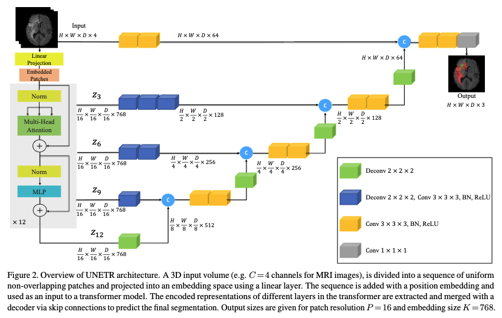
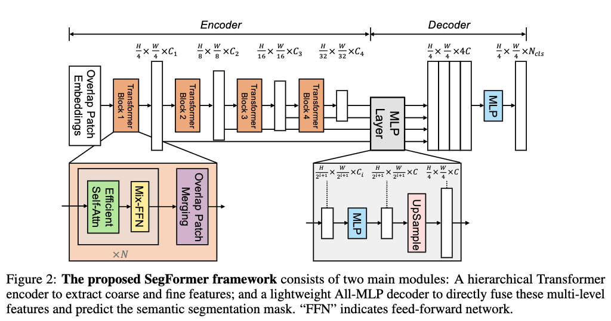

## UNETR: Mathematical Brief Explanation

{ width=90%; style="display: block; margin: 0 auto"}

### 1. 3D Patch Embedding and Sequence Formulation
Given a 3D medical image volume defined as $ x \in \mathbb{R}^{H \times W \times D \times C} $ (where $C$ is the number of input channels), UNETR flattens the volume into a sequence of uniform, non-overlapping 3D patches $ x_v \in \mathbb{R}^{N \times (P^3 \cdot C)} $.

The spatial resolution of each patch is $ (P, P, P) $, which results in a sequence length of:
$$ N = \frac{H \times W \times D}{P^3} $$

These patches are projected into a constant $K$-dimensional embedding space using a linear projection matrix $ E \in \mathbb{R}^{(P^3 \cdot C) \times K} $. To retain spatial locality, a 1D learnable positional embedding $ E_{pos} \in \mathbb{R}^{N \times K} $ is added to the sequence:
$$ z_0 = [x_v^1 E; x_v^2 E; ...; x_v^N E] + E_{pos} $$

### 2. Transformer Encoder Blocks
The embedded sequence $ z_0 $ is processed through $ L $ consecutive Transformer blocks. Each block uses Layer Normalization ($\text{Norm}$), Multi-Head Self-Attention ($\text{MSA}$), and a Multilayer Perceptron ($\text{MLP}$) with GELU activations. For each layer $ i $ from $1$ to $L$:
$$ z'_i = \text{MSA}(\text{Norm}(z_{i-1})) + z_{i-1} $$ $$ z_i = \text{MLP}(\text{Norm}(z'_i)) + z'_i $$

### 3. Multi-Head Self-Attention (MSA) Dynamics
Within the $\text{MSA}$ sublayer, the input sequence $ z \in \mathbb{R}^{N \times K} $ is mapped to queries ($q$), keys ($k$), and values ($v$). For $ n $ parallel attention heads, the dimensionality of each head is scaled down to $ K_h = \frac{K}{n} $.

The self-attention weights ($A$) and outputs ($\text{SA}$) for a single head are calculated as: 
$$ A = \text{Softmax}\left( \frac{qk^\top}{\sqrt{K_h}} \right) $$ $$ \text{SA}(z) = A v $$

The outputs from all $ n $ attention heads are then concatenated and projected back to the original dimension $K$ using trainable weights $ W_{msa} \in \mathbb{R}^{n \cdot K_h \times K} $:
$$ \text{MSA}(z) = [\text{SA}_1(z); \text{SA}_2(z); ...; \text{SA}_n(z)] W_{msa} $$

### 4. Hybrid Segmentation Loss Function
Because UNETR addresses voxel-wise semantic segmentation, the model optimizes a composite loss function that combines a Soft Dice Loss (to maximize volume overlap) and a Cross-Entropy Loss (for stable pixel-wise classification).

For $I$ total voxels and $J$ total classes, where $G_{i,j}$ is the one-hot encoded ground truth and $Y_{i,j}$ is the predicted probability for class $j$ at voxel $i$, the objective function is:
$$ L(G,Y) = 1 - \frac{2}{J} \sum_{j=1}^{J} \frac{\sum_{i=1}^{I} G_{i,j} Y_{i,j}}{\sum_{i=1}^{I} G_{i,j}^2 + \sum_{i=1}^{I} Y_{i,j}^2} - \frac{1}{I} \sum_{i=1}^{I} \sum_{j=1}^{J} G_{i,j} \log Y_{i,j} $$

---

## SegFormer: Mathematical Brief Explanation

### 1. Efficient Self-Attention (Complexity Reduction)
Standard multi-head self-attention computes the attention weights for a query ($Q$), key ($K$), and value ($V$) as:
$$ \text{Attention}(Q, K, V) = \text{Softmax}\left( \frac{QK^T}{\sqrt{d_{head}}} \right)V $$

For an image with sequence length $N = H \times W$, this operation has a quadratic computational complexity of $O(N^2)$. SegFormer reduces this by applying a sequence reduction ratio $R$ to shrink the spatial dimensions of $K$ (and identically $V$) before computing attention:
$$ \hat{K} = \text{Reshape}\left(\frac{N}{R}, C \cdot R\right)(K) $$ $$ K_{new} = \text{Linear}(C \cdot R, C)(\hat{K}) $$

This linear projection shrinks the sequence length from $N$ to $\frac{N}{R}$, which successfully reduces the self-attention complexity from $O(N^2)$ down to $O(\frac{N^2}{R})$.

### 2. Mix-FFN (Positional Encoding Alternative)
Standard Vision Transformers add a fixed positional embedding vector to the input sequence. SegFormer eliminates this and instead calculates positional information dynamically using a $3 \times 3$ convolution inside the Feed-Forward Network (FFN):
$$ x_{out} = \text{MLP}(\text{GELU}(\text{Conv}_{3\times3}(\text{MLP}(x_{in})))) + x_{in} $$

Mathematically, the zero-padding inherent in the $3 \times 3$ convolution leaks absolute positional information into the feature maps. This makes the network invariant to changing input resolutions during inference.

### 3. Lightweight All-MLP Decoder
The decoder takes the 4 hierarchical feature maps $F_i$ (where $i \in \{1, 2, 3, 4\}$ with channel depths $C_i$) and applies a sequence of linear transformations to generate the final mask $M$.

First, a linear layer unifies the channel dimensions of all feature maps to a constant $C$:
$$ \hat{F}_i = \text{Linear}(C_i, C)(F_i), \quad \forall i $$

Second, all features are upsampled to the same spatial resolution, which is $\frac{1}{4}$ of the original image:
$$ \hat{F}_i = \text{Upsample}\left(\frac{H}{4} \times \frac{W}{4}\right)(\hat{F}_i), \quad \forall i $$

Third, the upsampled features are concatenated along the channel axis and fused via another linear layer:
$$ F = \text{Linear}(4C, C)(\text{Concat}(\hat{F}_i)) $$

Finally, a linear projection outputs the class predictions for $N_{cls}$ categories:
$$ M = \text{Linear}(C, N_{cls})(F) $$