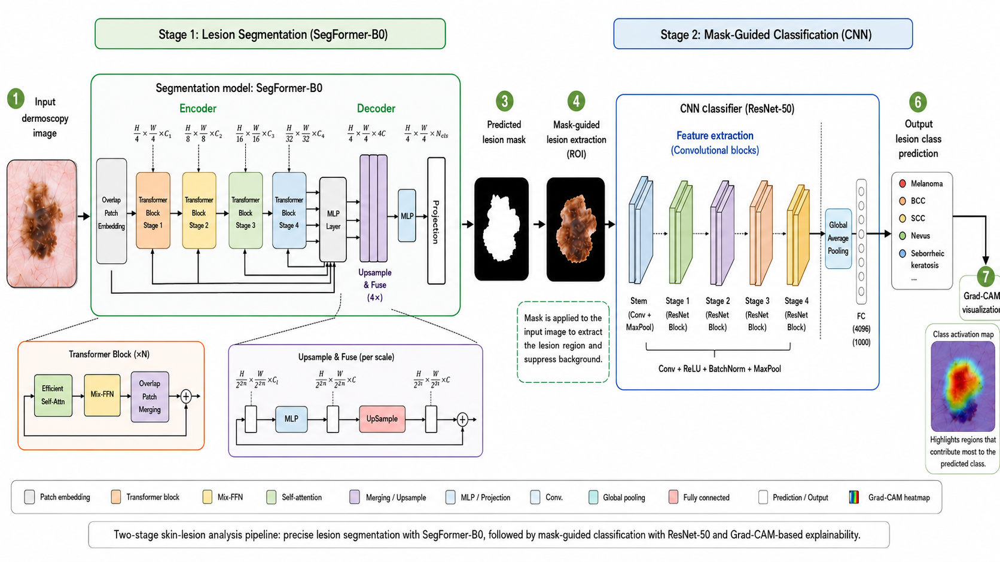

# 🔬 Segmentation-Guided Explainable Deep Learning for Skin Lesion Diagnosis

> **Deep Learning 2026 — Course Project | University of Bern**
>
> A three-stage pipeline that segments skin lesions, classifies them into 7 diagnostic categories, and explains predictions using Grad-CAM — deployed as a live web application.

**🌐 Live Demo:** [https://deep-learning-seg-class-ai.vercel.app/](https://deep-learning-seg-class-ai.vercel.app/)

***

## 👥 Authors

| Name | Email |
|------|-------|
| Md Mashfiq Khan | md.khan@students.unibe.ch |
| Md. Mahadi Hassan Munna | mahadi.munna@students.unibe.ch |
| Ananthakrishnan Paicheril Unnikrishnan | ananthakrishnan.paicherilunnikrishnan@students.unibe.ch |

***

## 📋 Table of Contents

- [Overview](#overview)
- [Pipeline Architecture](#pipeline-architecture)
- [Dataset](#dataset)
- [Results](#results)
- [Project Structure](#project-structure)
- [Installation](#installation)
- [Usage](#usage)
- [Models](#models)
- [Reproducibility](#reproducibility)
- [Limitations](#limitations)
- [References](#references)

***

## Overview

Skin lesion classifiers trained on raw dermoscopic images tend to exploit background skin, hair, and imaging artifacts as spurious shortcuts rather than diagnostically relevant morphology. This project proposes a **segmentation-guided explainable diagnostic framework** that:

1. **Segments** the lesion region using SegFormer-B0, removing background noise
2. **Classifies** the masked lesion into one of 7 diagnostic categories using ResNet-50
3. **Explains** predictions using Grad-CAM, highlighting which lesion sub-regions drive each decision

The pipeline is trained and evaluated on the [HAM10000](https://dataverse.harvard.edu/dataset.xhtml?persistentId=doi:10.7910/DVN/DBW86T) dermoscopic image dataset and tested end-to-end on ISIC 2018 external images.

***

## Pipeline Architecture


***

## Dataset

### HAM10000

The project uses the [HAM10000 dataset](https://dataverse.harvard.edu/dataset.xhtml?persistentId=doi:10.7910/DVN/DBW86T) — a large collection of multi-source dermoscopic images of common pigmented skin lesions.

| Class | Label | Count | Description |
|-------|-------|-------|-------------|
| Melanocytic Nevi | `nv` | 6,705 | Benign moles |
| Melanoma | `mel` | 1,113 | Malignant skin cancer |
| Benign Keratosis | `bkl` | 1,099 | Non-cancerous growths |
| Basal Cell Carcinoma | `bcc` | 514 | Common skin cancer |
| Actinic Keratoses | `akiec` | 327 | Pre-cancerous lesions |
| Vascular Lesions | `vasc` | 142 | Blood vessel lesions |
| Dermatofibroma | `df` | 115 | Benign fibrous nodules |
| **Total** | | **10,015** | |

### Data Split (Lesion-Disjoint)

Images sharing the same `lesion_id` never appear across splits, preventing data leakage from multi-image lesions.

| Split | Images |
|-------|--------|
| Train | 5,995 (60%) |
| Validation | 2,040 (20%) |
| Test | 1,980 (20%) |

### Class Rebalancing

To address severe class imbalance, two complementary strategies were applied:

- **Offline augmentation** (Albumentations): all minority classes augmented to ≥ 6,500 samples; `nv` undersampled to 6,500
- **Online augmentation** (`HAM10000AugmentedDataset`): joint geometric transforms per batch (flips, rotations, random crops) applied identically to image and mask
- **`WeightedRandomSampler`**: inverse-class-frequency weights at the DataLoader level

**Augmentation pipeline includes:** horizontal/vertical flip, 0/90/180/270° rotation, ±30° free rotation, random resized crop (scale 0.8–1.0), ColorJitter (brightness/contrast/saturation ±0.2, hue ±0.05), ShiftScaleRotate, Gaussian noise.

***

## Results

### Main Results

| Experiment | Test Set | Accuracy | Macro-F1 | Other |
|------------|----------|----------|----------|-------|
| SegFormer-B0 Segmentation | HAM10000 (n=1,980) | — | — | Dice 0.9443, IoU 0.9018 |
| Mask-guided ResNet-50 | HAM10000 (n=1,980) | **91.46%** | **0.89** | Weighted-F1 0.92 |
| Full Pipeline (end-to-end) | ISIC 2018 (n=1,511) | **79.95%** | **0.7124** | Weighted-F1 0.7989 |

### Training History

| Stage | Val metric (epoch 1) | Val metric (epoch final) |
|-------|---------------------|--------------------------|
| Segmentation | Dice ~0.80 | Dice 0.943 (epoch 5, saturated) |
| Classification | Accuracy 67.35% | Accuracy 83.77% (epoch 20) |

***

## Project Structure

```
├── Segformer_Ham_MaskGuided_Classification.ipynb  # Main training notebook
├── dataset.py                                      # Dataset classes with augmentation
├── helper_func.py                                  # Visualization and helper utilities
├── figures/                                        # Generated plots and visualizations
│   ├── seg_training_loss.png
│   ├── seg_training_dice.png
│   ├── resnet_training_curves.png
│   ├── resnet_confusion_matrix_normalized.png
│   ├── gradcam_masked.png
│   └── ...
├── report/                                         # LaTeX report source
│   └── main.tex
└── README.md
```

***

## Installation

### Requirements

```bash
pip install torch torchvision transformers
pip install pandas numpy scikit-learn matplotlib
pip install pillow albumentations scikit-image
pip install scipy seaborn monai grad-cam
```

Or install all at once:

```bash
pip install torch pandas numpy scikit-learn matplotlib torchvision pillow \
            transformers scikit-image scipy seaborn monai albumentations grad-cam
```

### Google Colab

The main notebook is designed to run on Google Colab with a T4 GPU. Mount your Drive and set paths accordingly:

```python
from google.colab import drive
drive.mount('/content/drive')
```

***

## Usage

### 1. Prepare the Dataset

Download HAM10000 from [Harvard Dataverse](https://dataverse.harvard.edu/dataset.xhtml?persistentId=doi:10.7910/DVN/DBW86T) and set the paths in the notebook:

```python
METADATA_PATH = "path/to/HAM10000_metadata.csv"
IMAGE_DIR     = "path/to/HAM10000_images/"
MASK_DIR      = "path/to/HAM10000_segmentations/"
OUTPUT_DIR    = "path/to/balanced_output/"
```

### 2. Run Class Rebalancing

Execute the augmentation cell in the notebook to generate a balanced dataset saved to `OUTPUT_DIR`. This step is skipped automatically if the balanced dataset already exists.

### 3. Train SegFormer-B0

```python
# Configured in the notebook — key settings:
model   = SegformerForSemanticSegmentation.from_pretrained(
              "nvidia/segformer-b0-finetuned-ade-512-512")
optimizer = AdamW(model.parameters(), lr=1e-4, weight_decay=1e-5)
# Train for 10 epochs; best checkpoint saved by validation Dice
```

### 4. Train ResNet-50 Classifier

```python
# Configured in the notebook — key settings:
model     = resnet50(pretrained=True)
model.fc  = nn.Linear(2048, 7)
optimizer = AdamW(model.parameters(), lr=1e-4, weight_decay=1e-4)
# Train for 20 epochs; best checkpoint saved by validation accuracy
```

### 5. Run End-to-End Inference + Grad-CAM

The notebook includes a full inference pipeline that:
1. Loads the best SegFormer and ResNet checkpoints
2. Predicts segmentation masks for new images
3. Applies mask-guided classification
4. Generates Grad-CAM heatmaps for the predicted class

***

## Models

### SegFormer-B0 (Segmentation)

- **Base model:** `nvidia/segformer-b0-finetuned-ade-512-512`
- **Modification:** 150-class decode head replaced with a single binary lesion channel
- **Loss:** BCE + Dice loss — balances local pixel accuracy with global overlap quality
- **Upsampling:** Logits bilinearly upsampled to 224×224 before loss computation

### ResNet-50 (Classification)

- **Base model:** `microsoft/resnet-50` (ImageNet pretrained)
- **Modification:** Final FC layer replaced with a 7-class head
- **Input:** Mask-guided image `x_masked = x ⊙ m`
- **Loss:** Cross-entropy

### Grad-CAM (Explainability)

- Applied to the final convolutional layer of ResNet-50
- Heatmap overlaid on the mask-guided lesion image
- Used as an auditing tool — not a training objective

***

## Reproducibility

| Component | Setting |
|-----------|---------|
| Image size | 224 × 224 |
| Normalization | ToTensor() → [1]; mask binarized at 0.5 |
| Mask interpolation | NEAREST (preserves binary boundaries) |
| Segmentation GPU | NVIDIA T4 (Google Colab) |
| Classification GPU | Apple M4 10-core |
| Segmentation training time | ~30 minutes |
| Classification training time | ~2 hours |

> ⚠️ **Note:** Results are single-run measurements. Multi-seed averaging and confidence intervals are identified as future work.

***

## Limitations

- **11.5-point accuracy gap** between internal (91.46%) and end-to-end (79.95%) results due to: predicted-mask error propagation, ISIC 2018 distribution shift, and severe class imbalance in minority categories.
- **Grad-CAM is post-hoc** — heatmaps show regions associated with decisions, not causal proof of learned diagnostic criteria. Must be used alongside quantitative metrics and expert review.
- **Single-run results** — no mean ± std over multiple seeds reported.
- **No ECE calibration** — temperature scaling applied at inference but systematic calibration not evaluated.
- **No raw-image baseline** — benefit of segmentation guidance not quantified against an unmasked ResNet-50.

***

## References

1. P. Tschandl, C. Rosendahl, H. Kittler. *The HAM10000 Dataset.* Scientific Data, 2018.
2. N. Codella et al. *Skin Lesion Analysis Toward Melanoma Detection: ISIC 2018 Challenge.* arXiv:1902.03368, 2019.
3. E. Xie et al. *SegFormer: Simple and Efficient Design for Semantic Segmentation with Transformers.* NeurIPS, 2021.
4. K. He et al. *Deep Residual Learning for Image Recognition.* CVPR, 2016.
5. R. R. Selvaraju et al. *Grad-CAM: Visual Explanations from Deep Networks via Gradient-Based Localization.* ICCV, 2017.
6. I. Goodfellow, Y. Bengio, A. Courville. *Deep Learning.* MIT Press, 2016.

***

## License

This project is licensed under the MIT License. See [LICENSE](LICENSE) for details.

***

<p align="center">
  Made with ❤️ at the University of Bern · Deep Learning 2026
</p>
